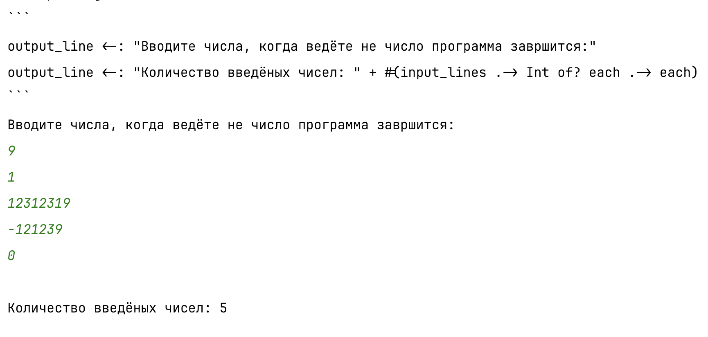
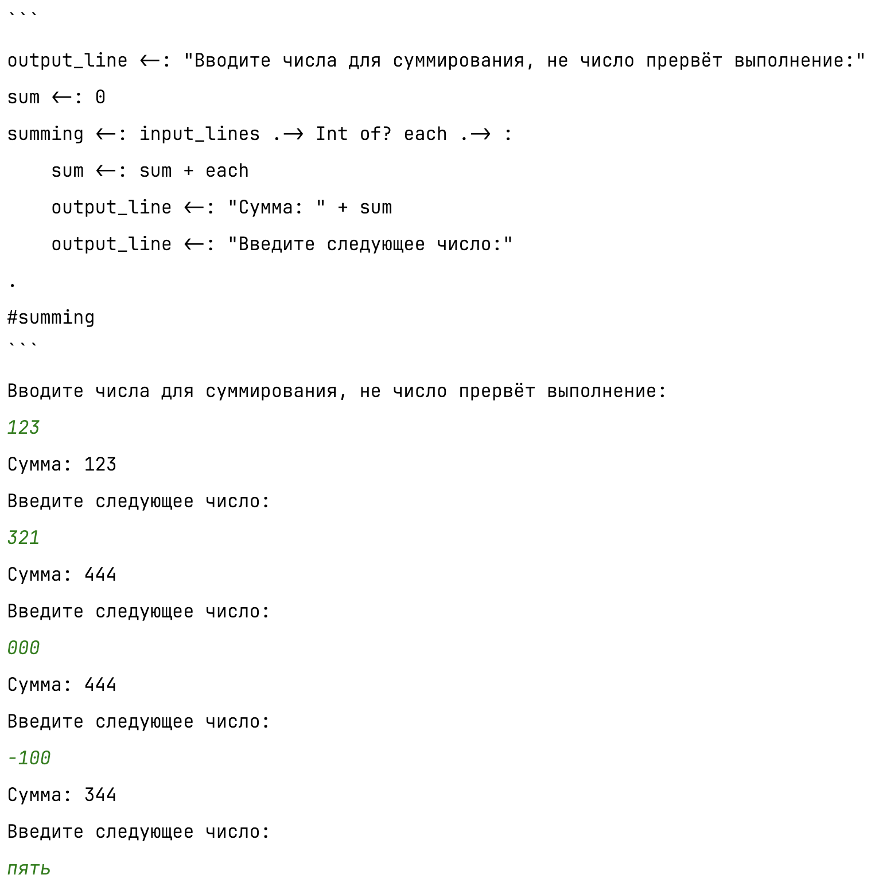
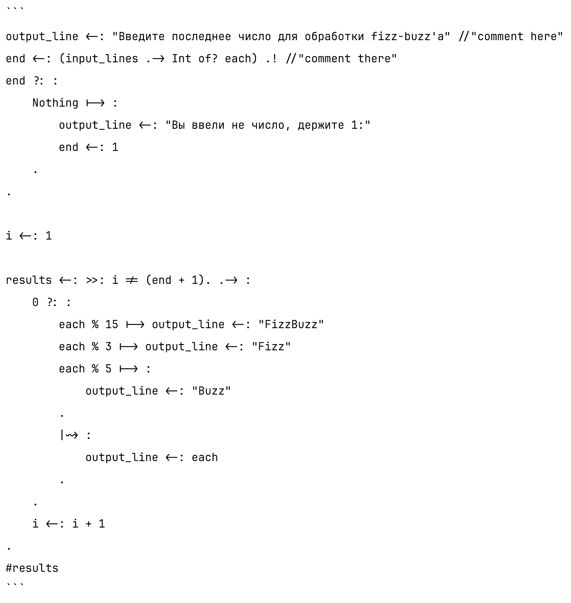
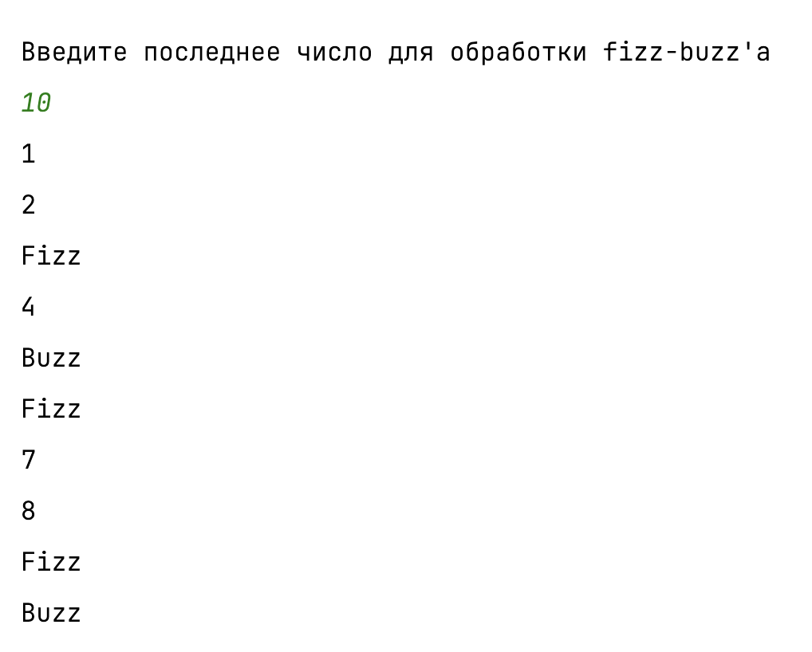

| № Теста |                 Название теста                  | Описание                                                                                                                                                                                                                                                                                             | Ожидаемый результат                                                                                                    | Полученный результат                                                                          | Вывод                |
|--------:|:-----------------------------------------------:|------------------------------------------------------------------------------------------------------------------------------------------------------------------------------------------------------------------------------------------------------------------------------------------------------|------------------------------------------------------------------------------------------------------------------------|-----------------------------------------------------------------------------------------------|:---------------------|
|       1 |     Работа с вводом и выводом, со строками      | Тестовый код выведет сообщение в консоль, подсчитает количество введённых чисел из консоли и выведет их количество, строки будут складываться                                                                                                                                                        | Все сообщения будут отображены, подсчёт будет правильным, программа завершится без ошибок, строки успешно складываются | Сообщения выведены, подсчёт корректен, сообщение успешно образовано при помощи сложения строк | Тест пройден успешно |
|       2 |    Работа с числами и циклами: подсчёт суммы    | Тестовый код выведет сообщение в консоль, подсчитает сумму введённых чисел из консоли и выведет её                                                                                                                                                                                                   | Все сообщения будут отображены, подсчёт будет правильным, программа завершится без ошибок                              | Сообщения выведены, подсчёт корректен                                                         | Тест пройден успешно |
|       3 | Работа с операторами ветвления, задача FizzBuzz | Задача заключается в получении последнего числа для проверки N, для каждого числа от 1 до N решается, что будет выведено: FizzBuzz для делимого на 15 без остатка, Fizz при делении без остатка на 3, Buzz при делении без остатка на 5 и само число, если ни одно из прошлых условий не выполнилось | Для каждого из чисел от 1 до N вывод корректен                                                                         | Для чисел от 1 до N вывод корректен                                                           | Тест пройден успешно |

| 1                         | 2                         | 3                                         |
|---------------------------|---------------------------|-------------------------------------------|
|  |  |  |
|                           |                           |            |

